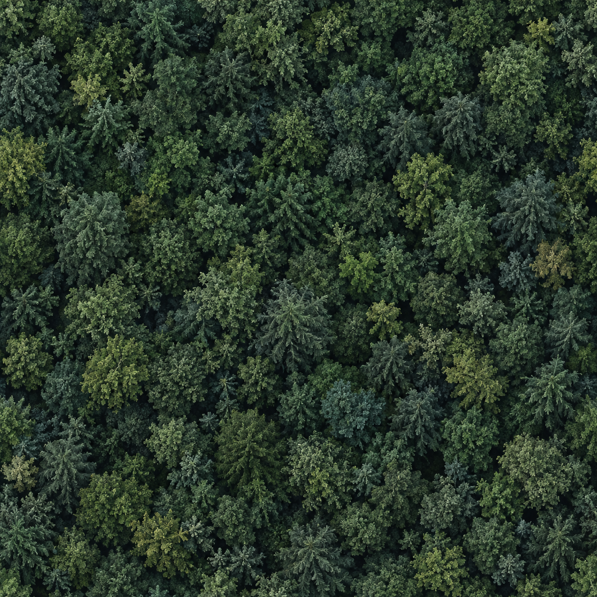

# Forest canopy material provenance and adoption

The stage11 canopy material is an original image generated with the imagegen skill and built-in image generation tool. The saved 1254 ×1254 PNG was copied without alteration to `public/assets/terrain/forest-canopy-albedo-v1.png`. Its source path, SHA-256 and read-only pixel audit are recorded in `artifacts/forest-canopy-asset-v1.json`.

The prompt requested an overhead diffuse view of dense mixed evergreen woodland, subdued green/blue-green/olive crowns, soft neutral lighting, no roads or borders, and a repeatable120 ×120m material. That size is an authored mapping choice, not a measured aerial survey. No ACE COMBAT image is used as a game texture.

The image is not certified pixel-seamless: opposite-edge mean RGB differences are17.44 horizontally and17.02 vertically, versus a sampled ordinary horizontal-neighbor difference of11.50. These statistics do not determine whether a rendered Repeat boundary is visible. Actual near/far high and lower-resolution scene inspection is required. No raster editing or pixel transformation was performed.

The first stage11 candidate in `artifacts/review-round10/biomes-attempt1/` failed independent adoption: sparse blue faceted crowns on a vast dark bare floor did not resemble the reference video's dense blue-green forest. Stage8/17 dry floors separately passed their limited adoption review. The second candidate in `biomes-attempt2/` also failed independent image adoption: technically continuous nonflat masses and additional leaf texture still read as a dark carpet or shallow embankments, with isolated boulder-like crowns. Five completed images and source hashes are preserved. The third correction in `biomes-attempt3/` has five completed fixed-source images. Independent reviewers agree that ordinary raised volume, soil separation and low-profile crown retention improved, but the strict woodland gate still fails because broad bare gaps and angular boulder/hedge-like crowns remain.

The fourth fixed candidate in `biomes-attempt4/` improves near coverage, rounding and low-profile retention. Full woodland adoption still fails: repeated rounded crowns, row-like layout, straight stand borders and the aerial-photo pattern pasted onto dark globe-like crowns remain visible. The translated-camera/player cache correction independently passes bounded fresh-pool comparisons; moving selection/pop is unverified. Its Stage11 performance data is separately saved in `performance-forest-v4/`. The user accepts low FPS on this PC. A fifth correction is now active, separating individual-crown foliage detail from the aerial texture used on distant woodland masses. Neither an attractive asset nor geometry checks establish commercial AAA visual quality.
